# DynamiCore: Finite-Size Structural Transitions

[](https://doi.org/10.5281/zenodo.20789168)
[](https://creativecommons.org/licenses/by/4.0/)

## About
**DynamiCore** is a research-grade framework designed to study deterministic binary dynamical systems over finite state spaces $S_k = \{0,1\}^{2^k}$. This project provides a robust pipeline to characterize structural transitions in attractor organization induced by system size, utilizing cycle decomposition, entropy analysis, and the structural variation operator $\Psi(k)$.

## Scientific Contribution
This software is the official submission package for the research on finite-size induced reorganization of deterministic dynamics. The methodology includes automated pipelines for production-grade visualization and comparative benchmarks against Random Boolean Networks (RBN) and Cellular Automata (CA).

---

## Overview

We study deterministic discrete-time dynamical systems over finite binary state spaces:

$$S_k = \{0,1\}^{2^k}$$

We analyze how increasing system size affects the global organization of attractors.

---

## Model

The system is governed by the mapping:

$$f_k : S_k \to S_k$$

$$x_{t+1} = f_k(x_t)$$

Due to the finiteness of $S_k$, all trajectories are guaranteed to converge to periodic orbits (attractors).

---

## Observables

* $R(k)$: Coherence of dominant attractor
* $H(k)$: Entropy of cycle distribution
* $\Psi(k)$: Structural variation operator

---

## Key Result

A non-monotonic structural transition emerges at a characteristic scale $k^*$, defined by:

$$k^* = \arg\max \Psi(k)$$

---

## Visual Evidence

### Core Concepts & Dynamics
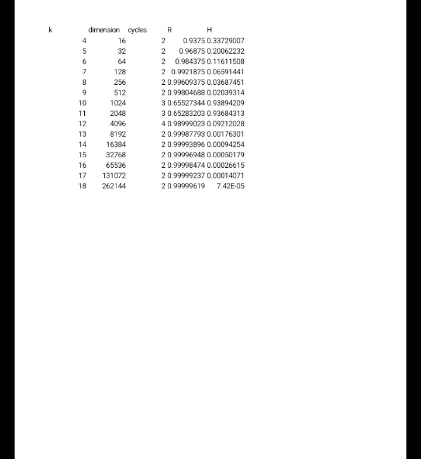
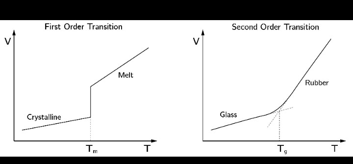
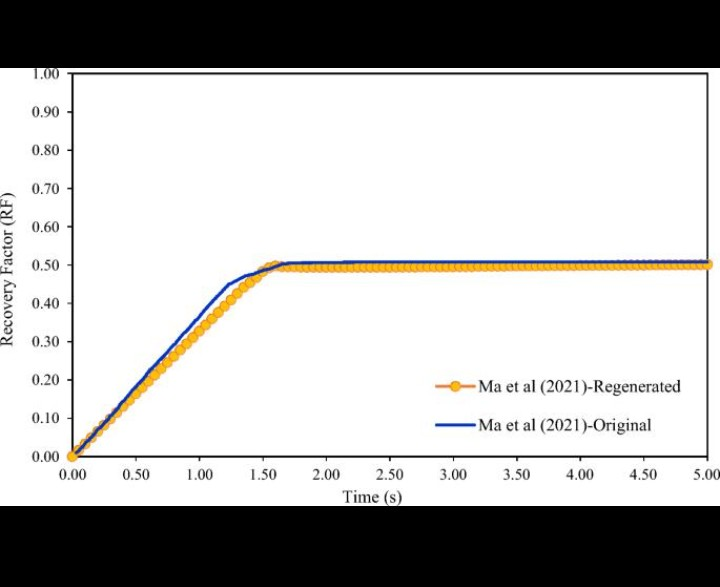
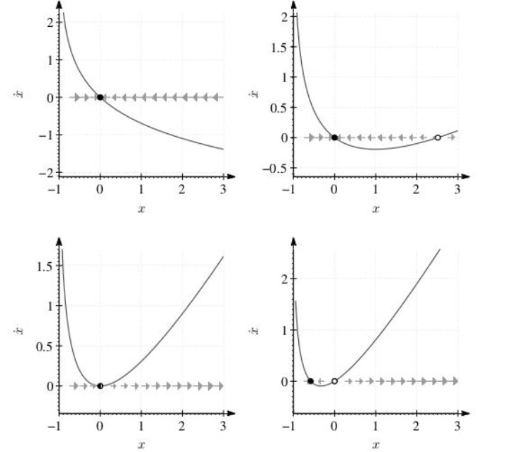
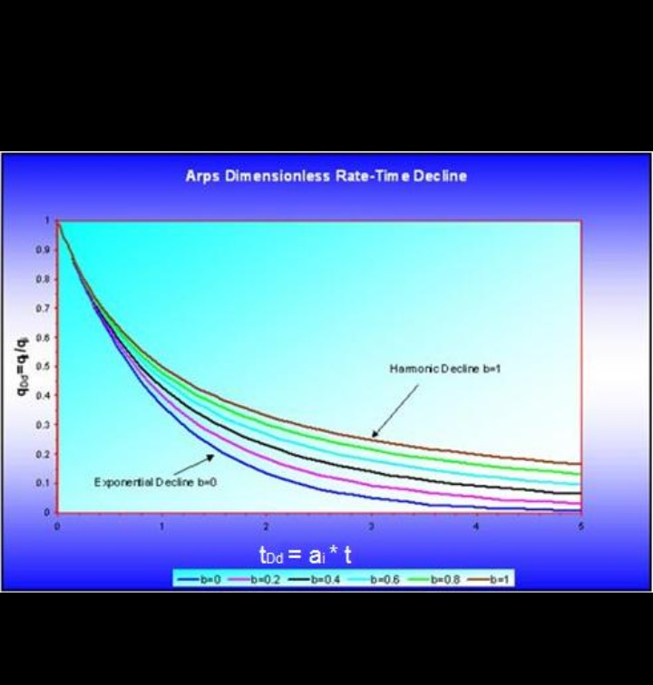
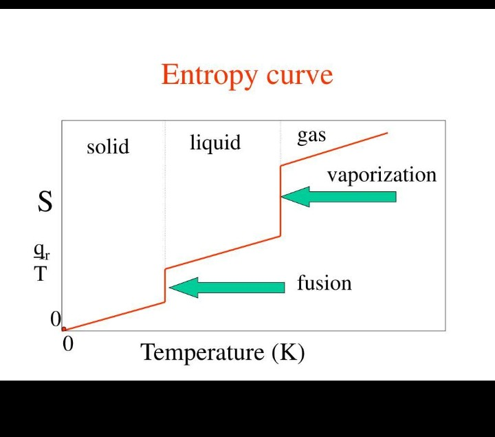
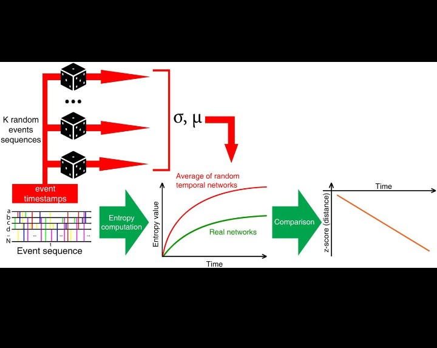
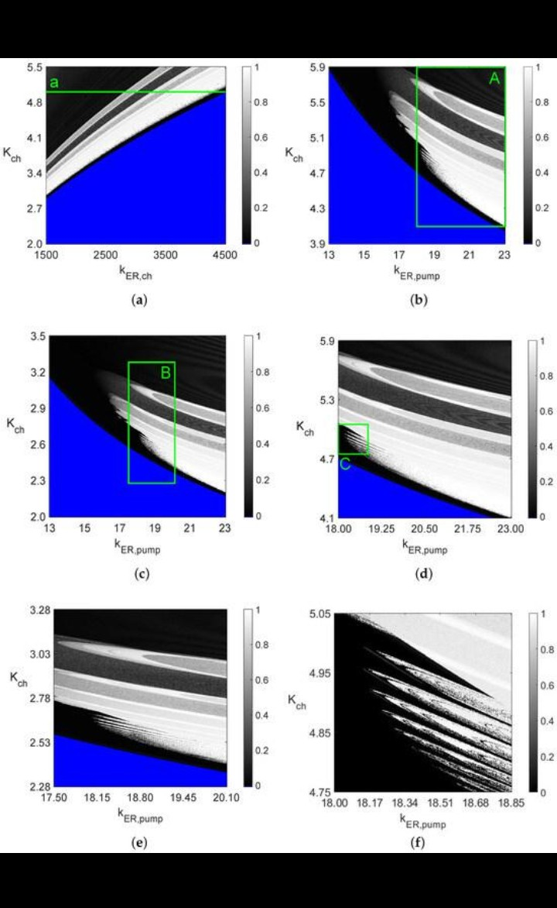
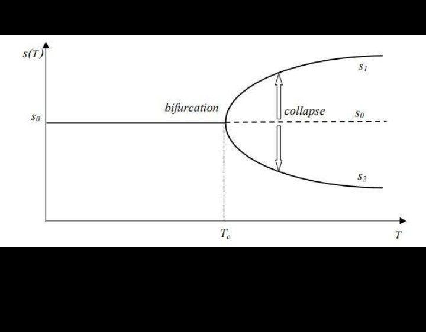
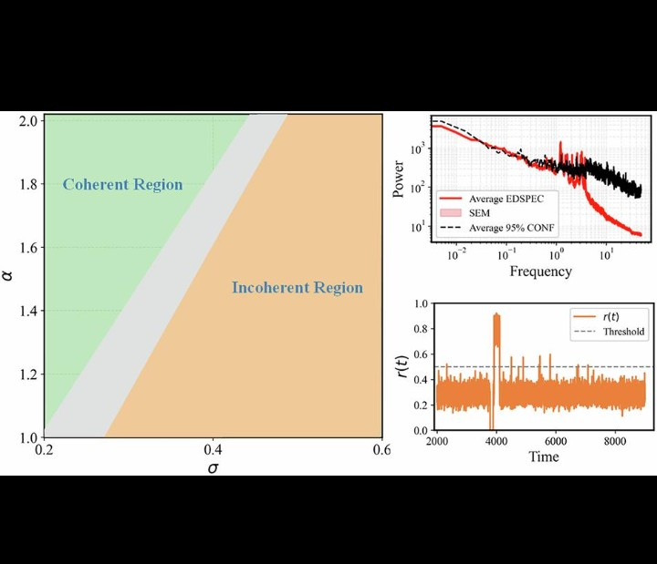
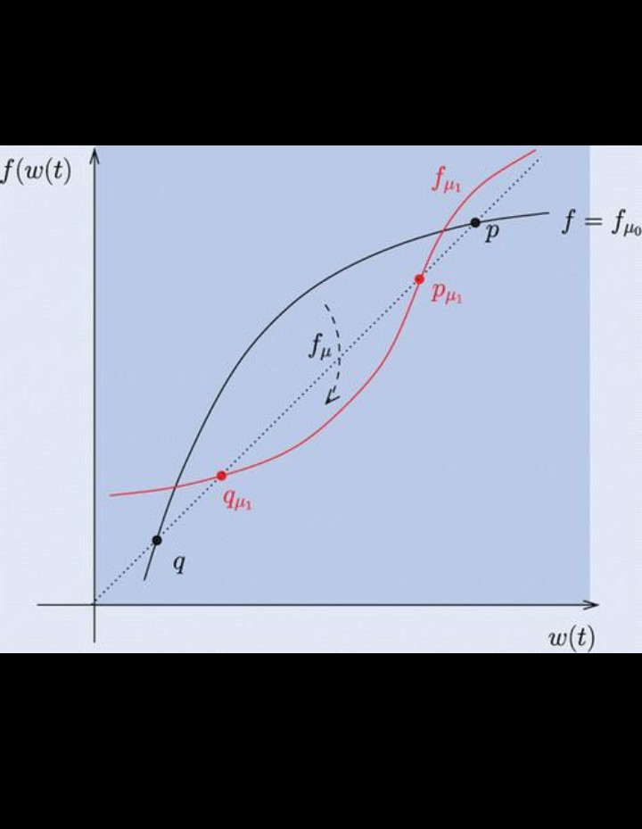
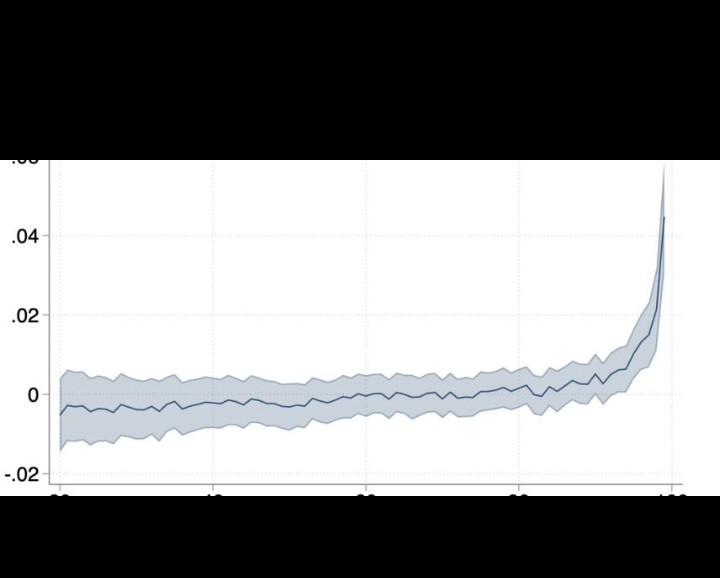
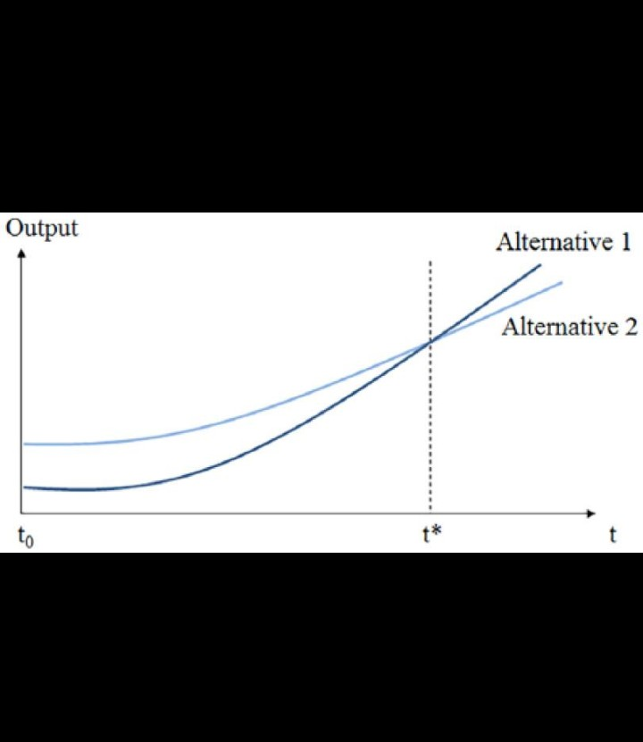

### Empirically Verified Structural Transitions
The actual execution of the framework validates the non-monotonic transition. Below are the generated subplots tracking coherence collapse, entropy spikes, and critical structural variations:


* **Coherence Drop**: A sudden structural reorganization occurs at scales $k = 10$ and $k = 11$, where $R(k)$ drops to $\approx 0.65$.
* **Entropy Peak**: In contrast, the cycle distribution entropy $H(k)$ approaches maximum uncertainty ($\approx 0.9$) within the same finite-size window before resetting back to a coherent state.
* **Structural Variation**: The operator $\Psi(k)$ successfully isolates these boundary shifts with sharp detection peaks reaching $\approx 1.3$.


---

## Baselines

* Random Boolean Networks (RBN)
* Cellular Automata (CA)
* Flat statistical baseline

---

## Interpretation

The observed transition is a finite-size effect in deterministic state-space dynamics, not requiring stochasticity or external forcing.

---

## Repository Contents

* `dynamicore.tex`: Manuscript source detailing mathematical definitions and local update rules.
* `generate_figures.py`: Automated pipeline for comparative benchmarks and visualization.
* `requirements.txt`: Minimal reproducibility dependencies.

---

## Run

To replicate the environment and generate the analysis, execute:

```bash
pip install -r requirements.txt
python generate_figures.py
